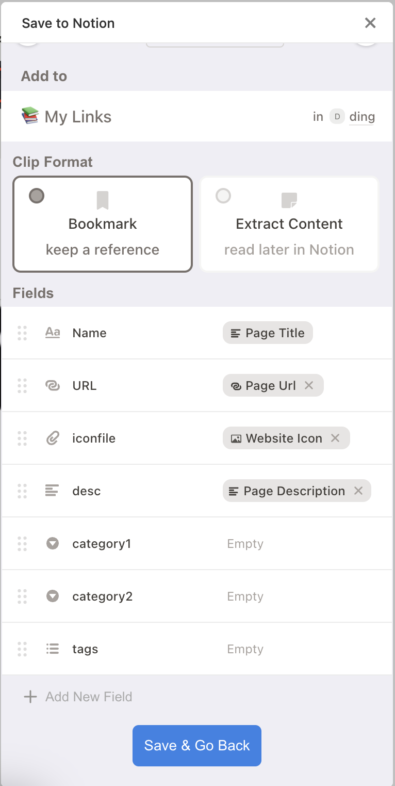

# 收集网站

Notion Bookmarks 提供了多种方式来帮助您快速、便捷地收集和整理您喜爱的网站。

## 方法一：浏览器扩展（推荐）

### Save to Notion 扩展

推荐使用 **Save to Notion** Chrome 浏览器扩展来快速收集网站。

**🔗 安装链接：**[Chrome 应用商店](https://chrome.google.com/webstore/detail/save-to-notion/ldmmifpegigmeammaeckplhnjbbpccmm)

**📝 使用步骤：**
1. 安装扩展后，点击浏览器工具栏中的 Save to Notion 图标
2. 首次使用需要连接您的 Notion 账户
3. 选择要保存到的数据库（选择您的"导航链接"数据库）
4. 扩展会自动抓取当前页面的标题、URL、描述和图标
5. 您可以添加分类、标签等额外信息
6. 点击保存即可将网站添加到您的 Notion 数据库

## 方法二：手动添加

您也可以随时直接在 Notion 数据库中手动添加新的网站链接。

1.  打开您复制的 “导航链接” 数据库。
2.  点击 **New** 创建一个新条目。
3.  填写以下字段：
    -   **名称 (Name)**: 网站的名称。
    -   **链接 (URL)**: 网站的完整 URL。
    -   **描述 (Description)**: 对网站的简短介绍。
    -   **分类 (Category)**: 从关联的分类数据库中选择一个或多个分类。
    -   **标签 (Tags)**: 添加相关的标签，方便搜索和过滤。