# 快速上手

💡 **Notion Bookmarks** —— 把你的收藏夹升级为「可分享」的起始页

只需将网页链接保存到 Notion 数据库，系统即自动抓取 favicon、标题与摘要，实时生成高颜值、多主题切换的导航站。

## 核心亮点

- **零成本**：纯静态站点（Next.js + TailwindCSS），不依赖后端或数据库
- **一键部署**：Fork → 配置环境变量 → Vercel 上线，整个流程不到 3 分钟
- **高颜值**：深/浅色主题、响应式布局，自带时钟与天气微组件
- **易扩展**：支持多级分类、关键词搜索、自定义域名，SEO 友好

用 Notion Bookmarks，让散落各处的收藏一次性归位，随时随地优雅开启你的网络旅程。

## 一、准备账号

在开始之前，请确保您拥有以下账号：

### 1. GitHub 账号
注册地址：[https://github.com/signup](https://github.com/signup)

⚠️ **注意**：请不要使用 QQ 邮箱等国内邮箱，尽量使用 Hotmail 或 Gmail 等国际邮箱，否则下一步登录 Vercel 后会提示账号被封禁。

### 2. Vercel 账号
注册地址：[https://vercel.com](https://vercel.com)（推荐使用 GitHub 账号登录）

### 3. Notion 账号
注册地址：[https://www.notion.so/login](https://www.notion.so/login)

## 二、复制 Notion 模板

1. 访问 [Notion 模板](https://lofty-spear-6f1.notion.site/NotionBookmarks-157a26d324f380c08811f044c8563d04)
2. 点击右上角的 **Duplicate** 按钮，将模板复制到您的 Notion 工作区

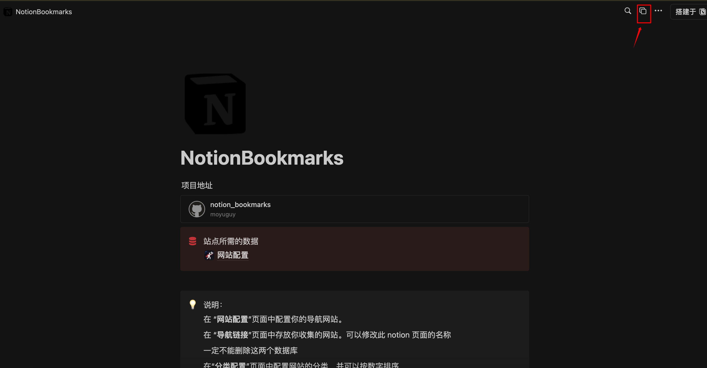

模板包含三个数据库：
- **网站配置**：存储网站基本信息和设置
- **导航链接**：存储所有书签条目
- **分类配置**：管理导航分类

## 三、创建 Notion 集成

### 1. 创建集成

1. 访问 [Notion 集成管理页面](https://www.notion.so/my-integrations)
2. 点击 **+ New integration** 创建新集成
3. 填写集成名称（如：NotionBookmarks）
4. 选择关联的工作区
5. 点击 **Submit** 创建

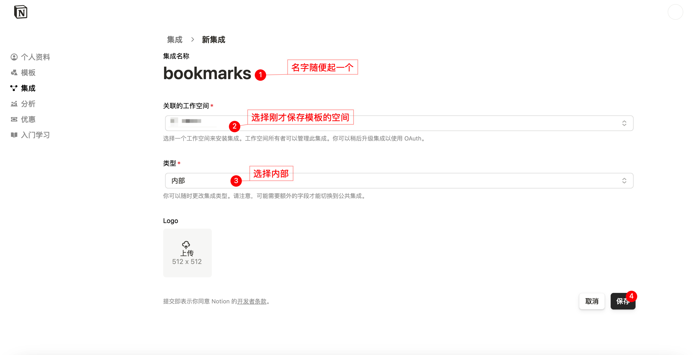

### 2. 获取集成密钥

创建完成后，复制 **Internal Integration Token**（集成密钥），后续配置需要用到。

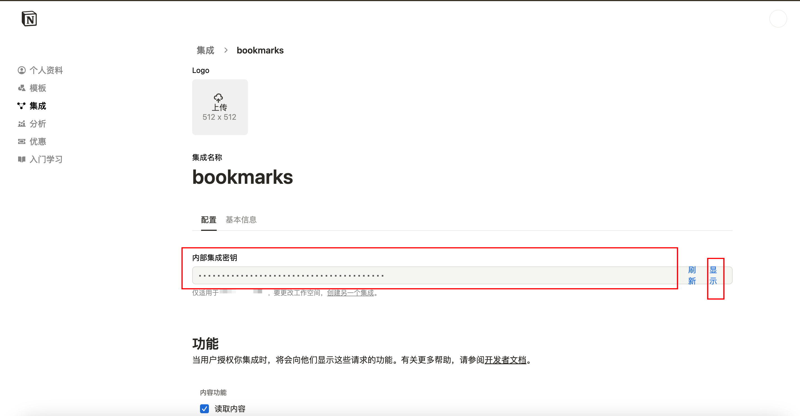

### 3. 将集成添加到数据库

1. 打开您复制的 Notion 模板页面
2. 点击右上角的三个点 `⋯`
3. 选择 **Add connections**
4. 找到并选择您刚创建的集成
5. 点击 **Confirm** 授予访问权限

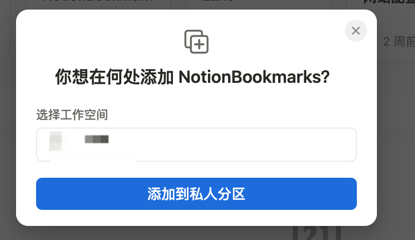
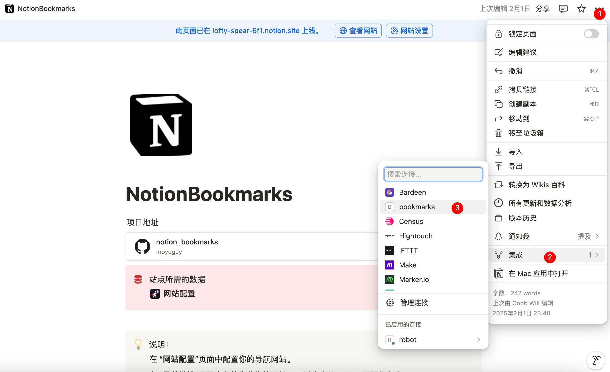

至此，Notion 表格配置完成，我们就能通过 API 访问 Notion 中的表格了。

## 四、准备环境变量

### 1. 获取数据库 ID

您需要获取三个数据库的 ID，方法是在浏览器中打开对应的 Notion 页面，从 URL 中提取 ID：

```
https://www.notion.so/workspace/数据库名称-{数据库ID}?v=视图ID
```

数据库 ID 是斜杠后面、问号前面的那一串字符。

分别获取以下三个数据库的 ID：
- **NOTION_WEBSITE_CONFIG_ID**：网站配置数据库 ID
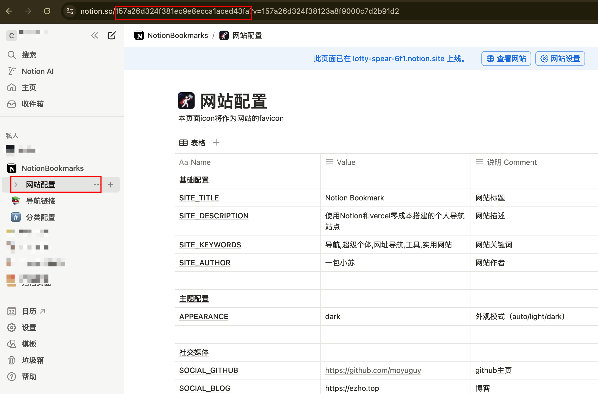
- **NOTION_LINKS_DB_ID**：导航链接数据库 ID  
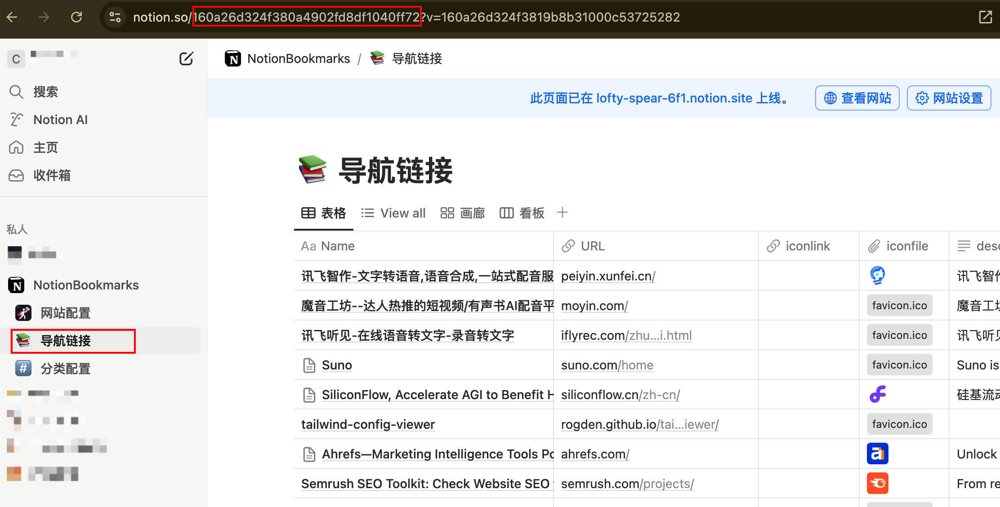
- **NOTION_CATEGORIES_DB_ID**：分类配置数据库 ID
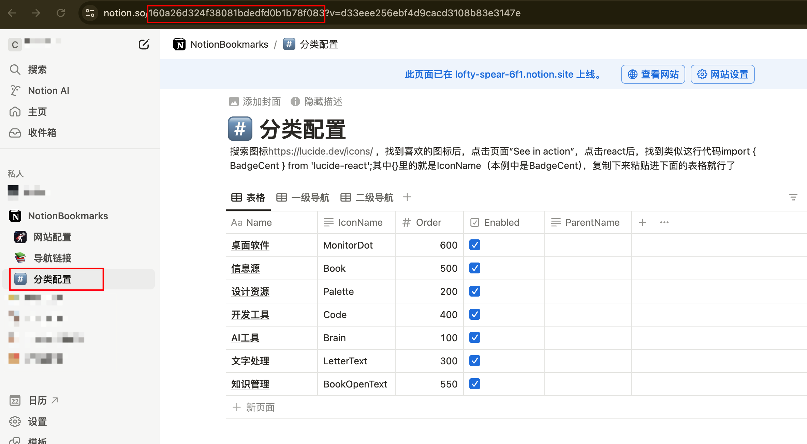

### 2. 准备环境变量文本

找个文本编辑器，按照以下格式准备环境变量：

```
NOTION_TOKEN=你的_notion_集成密钥
NOTION_LINKS_DB_ID=你的_链接数据库_id
NOTION_WEBSITE_CONFIG_ID=你的_网站配置数据库_id
NOTION_CATEGORIES_DB_ID=你的_分类数据库_id
NEXT_PUBLIC_CLARITY_ID=可选的_clarity_跟踪_id
GA_ID=可选的_google_分析_id
```

将对应的值替换为您实际获取的内容。如果最后两项没有值，可以删除这两行。

## 五、复制源代码

1. 访问 [Notion Bookmarks GitHub 仓库](https://github.com/moyuguy/notion_bookmarks)
2. 点击右上角的 **Fork** 按钮
3. 选择您的 GitHub 账号，完成 Fork

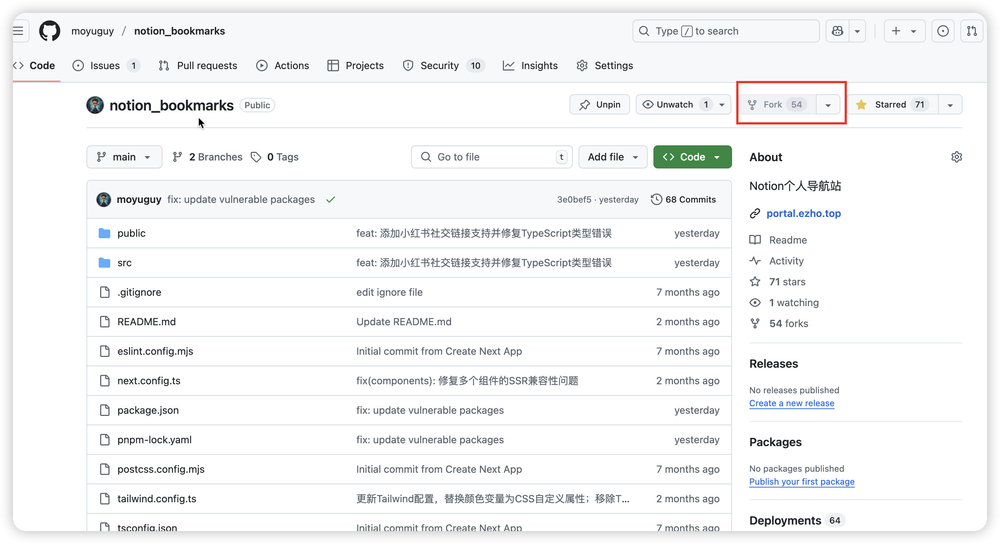

## 六、Vercel 部署

### 1. 导入项目

1. 登录 [Vercel](https://vercel.com)（推荐使用 GitHub 账号登录）
2. 点击 **Add New...** → **Project**
3. 在代码仓库列表中找到 `notion-bookmarks` 项目
4. 点击 **Import** 导入项目

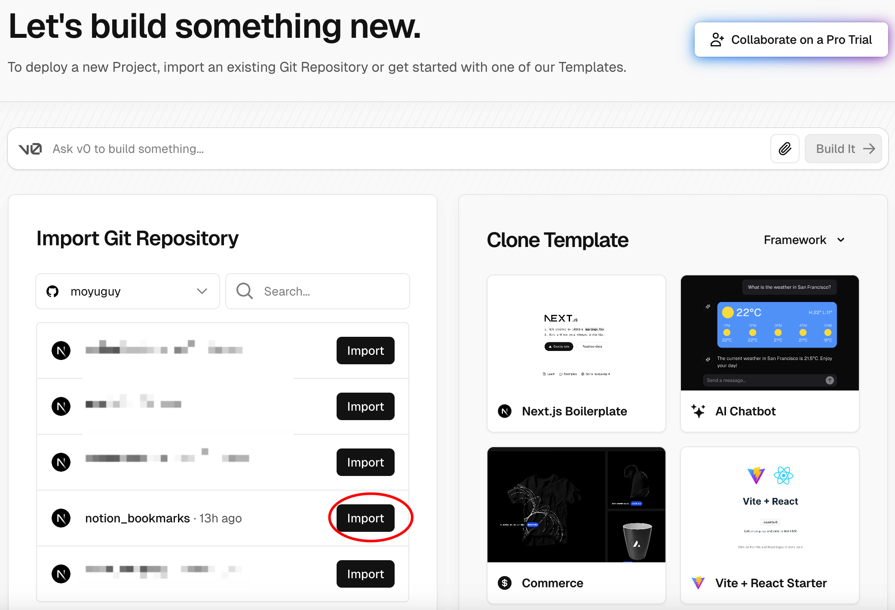

### 2. 配置环境变量

在项目配置页面的 **Environment Variables** 部分：

1. 将之前准备好的环境变量文本粘贴进来
2. 或者逐个添加每个环境变量

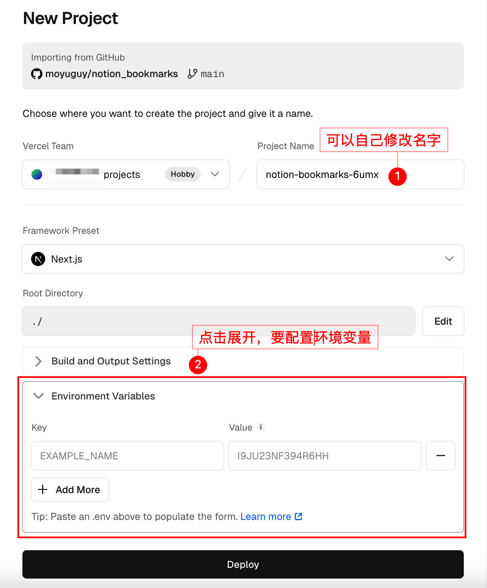


### 3. 部署项目

点击 **Deploy** 按钮，等待部署完成。通常需要 1-3 分钟。

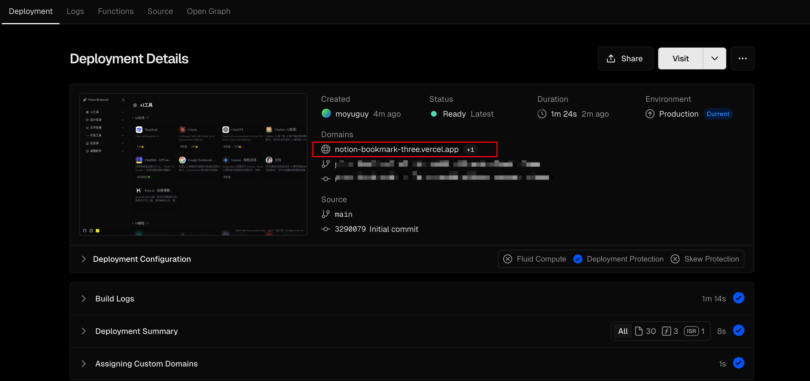

部署成功后，您将获得一个 Vercel 提供的域名，可以立即访问您的个人导航站！

## 七、自定义域名（可选）

如果您希望使用自己的域名，可以在 Vercel 项目设置中添加自定义域名。这样国内用户也能正常访问。

详细教程请参考：[Vercel 自定义域名配置](https://blog.tangly1024.com/article/vercel-domain)

## 八、版本更新

当项目有新版本时，您可以通过以下步骤更新：

1. 访问您 Fork 的 GitHub 仓库
2. 如果有更新，右上角会出现 **Sync fork** 按钮
3. 点击按钮同步最新代码
4. Vercel 会自动重新部署

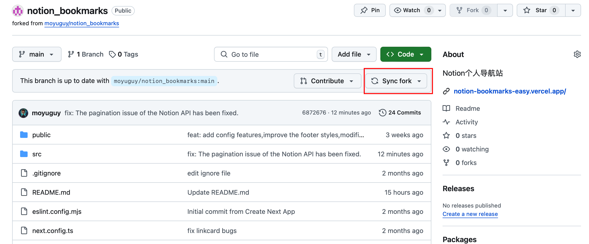

---

恭喜！您现在已经拥有了一个功能齐全的个人导航站。开始在 Notion 中添加您的书签，享受高效的网络导航体验吧！