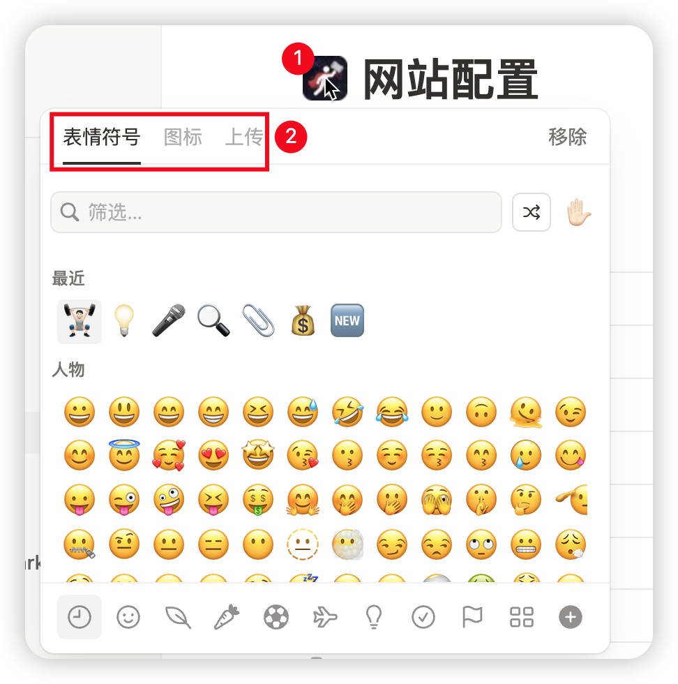

# 网站配置

## 网站图标配置
notion模板里网站配置页面的icon将作为网站的favicon

## 基础配置
这部分会影响SEO，建议认真配置，改成你自己的信息
| Name | Value | 说明 Comment |
| --- | --- | --- |
| `SITE_TITLE` | 一包小苏的个人导航站 | 网站标题 |
| `SITE_DESCRIPTION` | 使用Notion和vercel零成本搭建的个人导航站点 | 网站描述 |
| `SITE_KEYWORDS` | 导航,超级个体,网址导航,工具,实用网站 | 网站关键词 |
| `SITE_AUTHOR` | 一包小苏 | 网站作者 |

## 主题配置

| Name | Value | 说明 Comment |
| --- | --- | --- |
| `THEME_NAME` | cyberpunk-dark | 主题名称, 1)simple-light 2)simple-dark 3)cyberpunk-dark |
| ~~`SHOW_THEME_SWITCHER`~~ | true | ~~已废弃~~ ~~是否展示修改主题按钮, true展示, false不展示~~ |

## 社交媒体

| Name | Value | 说明 Comment |
| --- | --- | --- |
| `SOCIAL_GITHUB` | 填你的github账号 | github主页 |
| `SOCIAL_BLOG` | 填你的博客地址 | 博客 |
| `SOCIAL_X` | 填你的账号| X |
| `SOCIAL_JIKE` | 填你的账号 | 即刻 |
| `SOCIAL_WEIBO` |填你的账号| 微博 |
| `SOCIAL_XIAOHONGSHU` | 填你的账号| 小红书 |

## Widgets配置

| Name | Value | 说明 Comment |
| --- | --- | --- |
| `WIDGET_CONFIG` | 简易时钟,天气,圆形时钟,IP信息,热搜 | 直接填写需要展示的组件名称,用英文逗号`,`隔开, **按文本顺序排序** 支持的组件:`简易时钟,天气,圆形时钟,IP信息,热搜` 其中天气组件需要申请和风天气api,免费就够用: [https://dev.qweather.com/docs/start/](https://dev.qweather.com/docs/start/) |